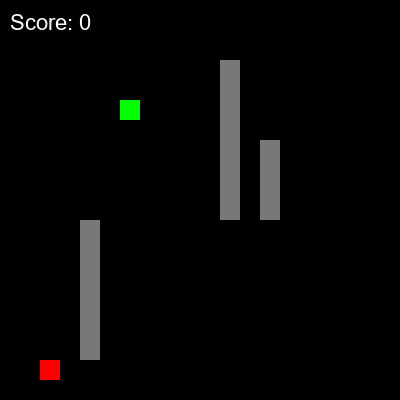

#  Snake-AI (Q-Learning)

A simple **tabular Q-learning** implementation that teaches an agent to play the classic Snake game built with *pygame*.


---

##  Project structure

```
.
├── constants.py   # shared game settings + colours
├── game.py        # SnakeGame environment (wrap, walls, score)
├── agent.py       # tabular Q-Learning agent
├── train.py       # CLI script to train and save qtable.pkl
├── play.py        # CLI script to load qtable.pkl, watch play, export GIF
└── README.md      # this file
```

---

## How it works

1. **State representation** – an 8-tuple of booleans  
   • 4 *danger* flags (collision if you move up / down / left / right)  
   • 4 *food* direction flags (food is up / down / left / right)
2. **Q-table** – Python dict mapping state-tuples → `np.array(4)` of Q-values
3. **Q-learning loop** – choose action (ε-greedy), execute, get reward, update table
4. **Exploration decay** – ε starts at 1.0 and decays by 0.995 per episode (min 0.01)
5. **Environment highlights** – screen wrap, dynamic walls; capped at 60 FPS

---

##  Example GIF





